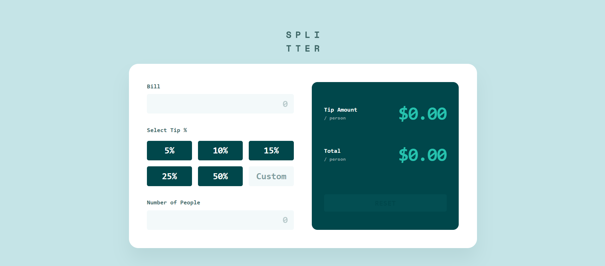

# Frontend Mentor - Tip calculator app solution

This is a solution to the [Tip calculator app challenge on Frontend Mentor](https://www.frontendmentor.io/challenges/tip-calculator-app-ugJNGbJUX). Frontend Mentor challenges help you improve your coding skills by building realistic projects.

## Table of contents

- [Overview](#overview)
  - [The challenge](#the-challenge)
  - [Screenshot](#screenshot)
  - [Links](#links)
- [My process](#my-process)
  - [Built with](#built-with)
  - [What I learned](#what-i-learned)
  - [Continued development](#continued-development)
  - [Useful resources](#useful-resources)
- [Author](#author)
- [Acknowledgments](#acknowledgments)

## Overview

### The challenge

Users should be able to:

- View the optimal layout for the app depending on their device's screen size.
- See hover and active states for all interactive elements, including input focus and button highlights.
- Calculate the correct tip and total cost of the bill per person based on custom or preset percentages.
- See a real-time error message (color: Orange 400) when the number of people input is zero or invalid.

### Screenshot

### Links

- Solution URL: [Github](https://github.com/enghalih/tip-calculator-app)
- Live Site URL: [Live Site](https://enghalih.github.io/tip-calculator-app/)

## My process

### Built with

- Semantic HTML5 markup
- SCSS with BEM (Block Element Modifier) methodology
- CSS Grid and Flexbox for responsive layout management
- Mobile-first workflow
- Vanilla JavaScript for dynamic calculations
- Accessibility features (ARIA Live Regions for result updates)

### What I learned

During this project, I significantly improved my understanding of professional front-end architecture. One of the biggest takeaways was learning how to write modular code, separating styles into partials and keeping logic independent.

I learned the importance of **ARIA-live regions** for accessibility, ensuring that screen readers can announce updated calculation results without moving focus. I also mastered the use of **SCSS Mixins** over Placeholders to solve issues with media queries, allowing for a more robust and responsive typography system based on the provided design presets.

On the logic side, I deepened my knowledge of JavaScript event handling, specifically using `oninput` for real-time calculations and handling mass data type conversion to avoid common pitfalls like string concatenation or `NaN` errors. I also learned how to bridge the gap between HTML's native `type="reset"` behavior and custom JavaScript UI updates to ensure the application state remains consistent after a reset.

### Continued development

- **Deepening Modular Logic:** While I have started writing independent functions, I want to further refine my ability to create fully decoupled JavaScript modules for better scalability.
- **Advanced SCSS:** I plan to explore more complex functions and maps in SCSS to manage large-scale design systems more efficiently.
- **Precision Math:** I want to continue perfecting how I handle "falsy" values and floating-point math precision in JavaScript to ensure 100% accuracy in financial applications.

### Useful resources

- [Sass Documentation](https://sass-lang.com/documentation/) - Helped me understand why `@extend` has limitations within media queries and how to transition to Mixins.
- [MDN Web Docs - ARIA live regions](https://developer.mozilla.org/en-US/docs/Web/Accessibility/ARIA/ARIA_Live_Regions) - Essential for understanding how to make dynamic content accessible.
- [JavaScript.info](https://javascript.info/) - Great for grasping the nuances between different input events and type conversions.

## Author

- Frontend Mentor - [@enghalih](https://www.frontendmentor.io/profile/enghalih)
- Github - [@enghalih](https://github.com/enghalih)
- Linkedin - [@enghalih | Wenning Ghalih](https://www.linkedin.com/in/enghalih/)

## Acknowledgments

Special thanks for the guidance on professional SCSS architecture, BEM naming conventions, and the technical breakdown of JavaScript event lifecycles that helped me solve complex UI bugs.